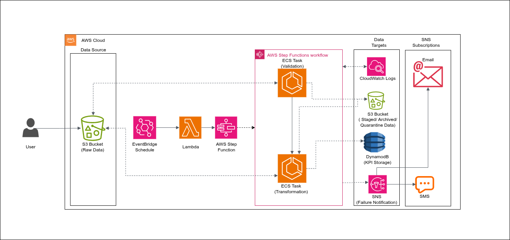
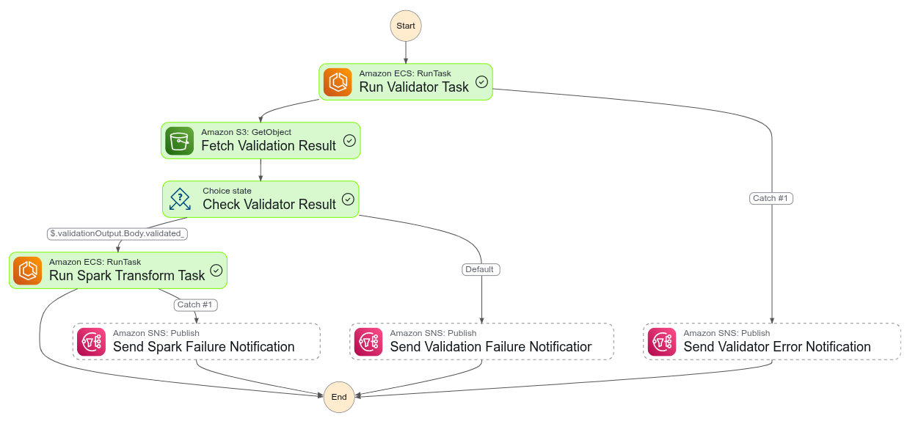

# Real-Time Event-Driven Data Pipeline for an E-Commerce Platform


## Project Overview

This project implements a real-time, event-driven data pipeline designed to ingest, validate, transform, and store KPIs derived from transactional e-commerce data. It uses AWS-native services in a containerized and serverless architecture, enabling immediate response to new data files dropped in Amazon S3.

### Architecture Summary


**Data Flow**:
- S3 (Raw Layer) — New CSV data files (orders, products, etc.) are uploaded here.
- An lambda invokes the step functions on schedules by an eventbridge
- Step functions
    - ECS Fargate Tasks:
        - Validation Task: Validates incoming data.
            - stores the validation results in s3

        - Transformation Task: Calculates KPIs from validated data.
        - Notifies on validation failure or transformation errors via Email (using SNS topic)

- DynamoDB — Stores computed KPIs for real-time querying.

- CloudWatch Logs — Logs for observability and debugging.


### Validation Rules

Each incoming file is validated by a containerized ECS task before further processing. Validation logic includes:
- Check if all neccesary files are available for transformation

- Schema Compliance: Required columns must be present.

- Null Checks: Specific columns must not contain nulls.


### Step Function Workflow

**State Machine Outline**

- Run Validator Task → Fetch Validation Result → Check Validator Result → Run Spark Transform Task → [Success | Fail] → [Success | Fail] 

- States:

    - Run Validator Task: Launches an ECS Fargate container to validate the uploaded CSV file.

    - Fetch Validation Result: Uses the aws-sdk:s3:getObject integration to fetch the result JSON file.

    - Check Validator Result:

        If status == passed, continue to transformation
        Else, go to failure state

    - Run Spark Transform Task: Another ECS Fargate task processes the clean data and computes KPIs.




## Features
| Component          | Tech Used                      | Description                                 |
| ------------------ | -------------------------------| ------------------------------------------- |
| **File Storage**   | Amazon S3                      | Stores raw and transformed files            |
| **Batch Schedule** | Event Bridge                   | Stores raw and transformed files            |
| **Orchestration**  | AWS Step Functions             | Coordinates validation and transformation   |
| **Validation**     | ECS Fargate + Python container | Validates schema and basic integrity        |
| **Transformation** | ECS Fargate + PySpark container| Cleans and writes curated Delta Lake output |
| **Alerting**       | SNS + (Email/SMS Subscription) | Sends notifications on errors/failures      |
| **Monitoring**     | CloudWatch Logs                | Debug containers and pipeline state         |


### Folder Structure
```
.
├── services/
│   ├── validation-task/        # Dockerized Python validator
│   └── spark-transform-task/   # Dockerized Spark job
├── step_function/
│   └── ecommerce_pipeline.asl.json  # Step Functions definition
└── .github/
    └── workflows/
        ├── docker-ecr-validator.yaml   # CI for validator image
        ├── docker-ecr-spark.yaml       # CI for Spark image
        └── deploy-stepfunction.yaml    # CI to deploy state machine
```

### Deployment
**Prerequisites**
- AWS CLI & Docker installed
- AWS IAM permission (ECS, Step functions, SNS, S3, lambda)
- AWS Services set in GitHub 
    - AWS_ACCESS_KEY_ID
    - AWS_SECRET_ACCESS_KEY
    - AWS_REGION
    - AWS_ACCOUNT_ID
    - VALIDATOR_ECR_REPOSITORY
    - VALIDATOR_ECR_REGISTRY
    - SPARK_ECR_REPOSITORY
    - SPARK_ECR_REGISTRY
    - STEP_FUNCTION_ROLE_ARN

## CI/CD Workflows
- **Validator Image Push:**
Triggered when changes are pushed to services/validation-task/ or .github/workflows/docker-ecr-validator.yaml.

- **Spark Image Push:**
Triggered when changes are pushed to services/spark-transform-task/.

- **Step Function Deployment:**
Triggered when changes are pushed to:
    - step_function/ecommerce_pipeline.asl.json
    - .github/workflows/deploy-stepfunction.yaml


### Notifications
Alerts are sent via SNS to ecommerce-etl-pipeline-alerts when:
- ECS Validator fails unexpectedly
- Validation fails (validated_status = false)
- Spark transformation fails


## dynamoDB Schema Design
1. Order Level
    - Name of the table: `ecommerce_order_kpis`
    - Partition Key: `order_date`

    -  Schemas:
    ```
        order_date - String
        return rate - Decimal(2 dcp)
        total_items_sold - Int
        total_orders - Int 
        total_revenue - Decimal(2 dcp)
        unique_customers - Int
    ```
2. Category Level
    - Name of the table: `ecommerce_category_kpis`
    - Partition Key: `category`
    - Sort Key: `order_date`
    -  Schemas:
    ```
        order_date - String
        category - String
        avg_order_value - Decimal(2 dcp)
        avg_return_rate - Decimal(2 dcp) 
        daily_revenue - Decimal(2 dcp)
    ```