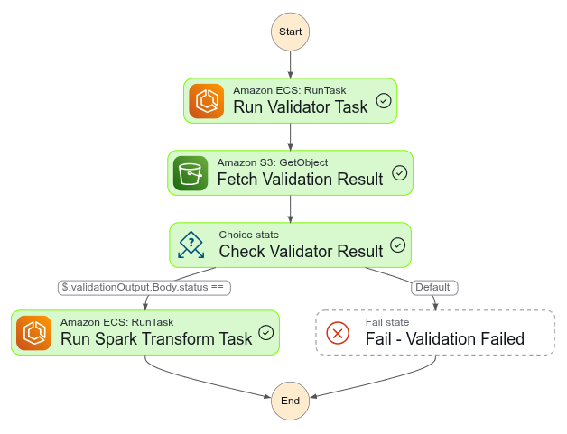

# Real-Time Event-Driven Data Pipeline for an E-Commerce Platform

## Project Overview

This project implements a real-time, event-driven data pipeline designed to ingest, validate, transform, and store KPIs derived from transactional e-commerce data. It uses AWS-native services in a containerized and serverless architecture, enabling immediate response to new data files dropped in Amazon S3.

### Architecture Summary

**Data Flow**:
- S3 (Raw Layer) — New CSV data files (orders, products, etc.) are uploaded here.
- Step Functions — Detects new files and orchestrates the workflow.
- ECS Fargate Tasks:
    - Validation Task: Validates incoming data.

    - Transformation Task: Calculates KPIs from validated data.

- DynamoDB — Stores computed KPIs for real-time querying.

- CloudWatch Logs — Logs for observability and debugging.

### Validation Rules

Each incoming file is validated by a containerized ECS task before further processing. Validation logic includes:

- Schema Compliance: Required columns must be present.

- Null Checks: Specific columns must not contain nulls.

### Step Function Workflow

**State Machine Outline**

- Run Validator Task → Fetch Validation Result → Check Validator Result → Run Spark Transform Task → [Success | Fail]

- States:

    - Run Validator Task: Launches an ECS Fargate container to validate the uploaded CSV file.

    - Fetch Validation Result: Uses the aws-sdk:s3:getObject integration to fetch the result JSON file.

    - Check Validator Result:

        If status == passed, continue to transformation
        Else, go to failure state

    - Run Spark Transform Task: Another ECS Fargate task processes the clean data and computes KPIs.

